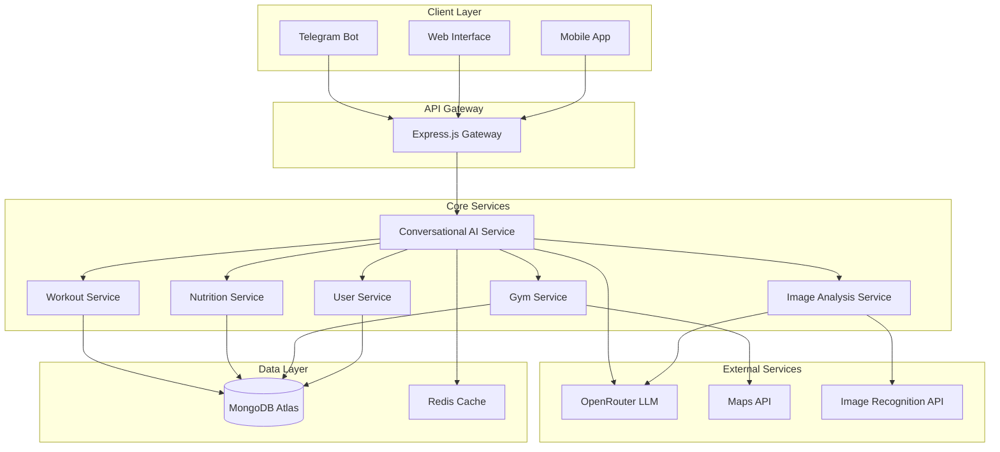

# Fit Buddy Design Document

## Overview

Fit Buddy is a conversational AI-powered fitness companion that provides personalized workout planning, nutrition tracking, gym location services, and intelligent coaching. The system leverages advanced language models for natural conversation, image recognition for food analysis, and location services for gym recommendations, all tailored specifically for Nigerian users.

The application follows a microservices architecture with a conversational AI core that orchestrates all user interactions, making the experience feel natural and dynamic rather than form-based or scripted.

## Architecture

### High-Level Architecture



### Technology Stack

- **Backend**: Node.js with Express.js
- **Database**: MongoDB Atlas (provided connection string)
- **Caching**: Redis for session management and quick data access
- **AI/LLM**: OpenRouter API (provided key)
- **Bot Interface**: Telegram Bot API (provided token)
- **Image Processing**: OpenRouter vision models + custom calorie estimation
- **Location Services**: Google Maps API or similar for gym location
- **Authentication**: JWT tokens with MongoDB session storage

## Components and Interfaces

### 1. Conversational AI Service

**Purpose**: Central orchestrator that handles all user interactions through natural language processing.

**Key Features**:
- Dynamic conversation flow management
- Context-aware responses
- Multi-turn conversation memory
- Intent recognition and entity extraction
- Personality and tone adaptation

**Interfaces**:
```typescript
interface ConversationService {
  processMessage(userId: string, message: string, context?: ConversationContext): Promise<AIResponse>
  startOnboarding(userId: string): Promise<OnboardingFlow>
  handleWorkoutSession(userId: string, sessionId: string): Promise<WorkoutSessionResponse>
  analyzeImage(userId: string, imageData: Buffer, context: string): Promise<ImageAnalysisResponse>
}

interface ConversationContext {
  currentActivity?: 'onboarding' | 'workout' | 'meal_planning' | 'gym_search'
  sessionData?: any
  userPreferences?: UserPreferences
  conversationHistory?: Message[]
}
```

### 2. User Service

**Purpose**: Manages user profiles, preferences, and onboarding data.

**Key Features**:
- User profile management
- BMI calculation and tracking
- Goal setting and progress tracking
- Preference storage and updates

**Data Models**:
```typescript
interface User {
  _id: ObjectId
  telegramId?: string
  profile: {
    name: string
    age: number
    height: number
    weight: number
    bmi: number
    fitnessGoal: 'lean' | 'bulk' | 'maintain'
    trainingPhilosophy: 'mentzer' | 'arnold' | 'custom'
    experienceLevel: 'beginner' | 'intermediate' | 'advanced'
  }
  schedule: {
    workDays: string[]
    availableHours: { start: string, end: string }[]
    preferredWorkoutDuration: number
    workoutDaysPerWeek: number
  }
  preferences: {
    reminderFrequency: string
    humorEnabled: boolean
    conversationStyle: 'casual' | 'professional' | 'motivational'
  }
  createdAt: Date
  updatedAt: Date
}
```

### 3. Workout Service

**Purpose**: Manages workout planning, exercise logging, and progress tracking.

**Key Features**:
- Dynamic workout plan generation
- Exercise database with Nigerian context
- Progress tracking and PR suggestions
- Recovery and deload recommendations

**Data Models**:
```typescript
interface WorkoutPlan {
  _id: ObjectId
  userId: ObjectId
  planType: 'full_body' | 'upper_lower' | 'push_pull_legs' | 'body_part_split'
  schedule: WorkoutDay[]
  philosophy: 'mentzer' | 'arnold' | 'custom'
  createdAt: Date
  isActive: boolean
}

interface WorkoutSession {
  _id: ObjectId
  userId: ObjectId
  plannedWorkout: ObjectId
  startTime: Date
  endTime?: Date
  exercises: ExerciseLog[]
  notes?: string
  isCompleted: boolean
}

interface ExerciseLog {
  exerciseId: ObjectId
  sets: SetLog[]
  notes?: string
}

interface SetLog {
  reps: number
  weight?: number
  rpe?: number
  restTime?: number
}
```

### 4. Nutrition Service

**Purpose**: Handles meal planning, calorie tracking, and nutritional guidance.

**Key Features**:
- Nigerian-specific meal database
- BMI-based calorie calculation
- Image-based food recognition
- Macro tracking and suggestions

**Data Models**:
```typescript
interface MealPlan {
  _id: ObjectId
  userId: ObjectId
  dailyCalories: number
  macroTargets: {
    protein: number
    carbs: number
    fats: number
  }
  meals: Meal[]
  culturalPreferences: string[]
  budgetTier: 'low' | 'medium' | 'high'
}

interface FoodItem {
  _id: ObjectId
  name: string
  localNames: string[]
  caloriesPerGram: number
  macros: {
    protein: number
    carbs: number
    fats: number
  }
  availability: 'common' | 'seasonal' | 'rare'
  averagePrice: number
}

interface FoodLog {
  _id: ObjectId
  userId: ObjectId
  timestamp: Date
  items: {
    foodId: ObjectId
    quantity: number
    calories: number
  }[]
  imageUrl?: string
  analysisConfidence?: number
}
```

### 5. Gym Service

**Purpose**: Manages gym location data, recommendations, and crowdsourced information.

**Key Features**:
- Location-based gym search
- Quality tier categorization
- Crowdsourced gym submissions
- User reviews and ratings

**Data Models**:
```typescript
interface Gym {
  _id: ObjectId
  name: string
  location: {
    address: string
    coordinates: [number, number]
    city: string
    state: string
  }
  qualityTier: 'local' | 'medium' | 'standard' | 'ultra_standard'
  amenities: string[]
  operatingHours: {
    [day: string]: { open: string, close: string }
  }
  contact: {
    phone?: string
    email?: string
    website?: string
  }
  ratings: {
    overall: number
    equipment: number
    cleanliness: number
    staff: number
  }
  submittedBy?: ObjectId
  verificationStatus: 'pending' | 'verified' | 'rejected'
  createdAt: Date
}
```

### 6. Image Analysis Service

**Purpose**: Processes food images to estimate calories and nutritional content.

**Key Features**:
- AI-powered food recognition
- Portion size estimation
- Nigerian food specialization
- Confidence scoring and validation

**Interfaces**:
```typescript
interface ImageAnalysisService {
  analyzeFoodImage(imageBuffer: Buffer, userId: string): Promise<FoodAnalysisResult>
  validateAnalysis(analysisId: string, userFeedback: FoodValidation): Promise<void>
  improveModel(correctAnalyses: FoodAnalysisResult[]): Promise<void>
}

interface FoodAnalysisResult {
  detectedItems: DetectedFood[]
  totalCalories: number
  totalMacros: MacroBreakdown
  confidence: number
  suggestions?: string[]
}

interface DetectedFood {
  name: string
  localName?: string
  estimatedWeight: number
  calories: number
  macros: MacroBreakdown
  confidence: number
}
```

## Data Models

### Core Collections

1. **users** - User profiles and preferences
2. **workout_plans** - Generated workout schedules
3. **workout_sessions** - Logged workout data
4. **exercises** - Exercise database with instructions
5. **meal_plans** - Personalized nutrition plans
6. **food_items** - Nigerian food database
7. **food_logs** - Tracked meals and calories
8. **gyms** - Gym location and information database
9. **conversations** - Chat history and context
10. **user_progress** - Weight, measurements, and achievements

### Indexing Strategy

```javascript
// Users collection
db.users.createIndex({ "telegramId": 1 }, { unique: true, sparse: true })
db.users.createIndex({ "profile.bmi": 1 })

// Gyms collection
db.gyms.createIndex({ "location.coordinates": "2dsphere" })
db.gyms.createIndex({ "qualityTier": 1, "location.city": 1 })

// Workout sessions
db.workout_sessions.createIndex({ "userId": 1, "startTime": -1 })

// Food logs
db.food_logs.createIndex({ "userId": 1, "timestamp": -1 })

// Conversations
db.conversations.createIndex({ "userId": 1, "timestamp": -1 })
db.conversations.createIndex({ "timestamp": 1 }, { expireAfterSeconds: 2592000 }) // 30 days
```

## Error Handling

### Error Categories

1. **User Input Errors**: Invalid data, missing required fields
2. **AI Service Errors**: LLM API failures, rate limiting
3. **Database Errors**: Connection issues, validation failures
4. **External API Errors**: Maps API, image recognition failures
5. **Business Logic Errors**: Invalid workout plans, nutritional conflicts

### Error Response Strategy

```typescript
interface ErrorResponse {
  success: false
  error: {
    code: string
    message: string
    userMessage: string
    retryable: boolean
  }
  context?: any
}

// Example error handling in conversation service
try {
  const response = await openRouterAPI.chat(messages)
  return response
} catch (error) {
  if (error.status === 429) {
    return {
      success: false,
      error: {
        code: 'RATE_LIMITED',
        message: 'OpenRouter API rate limit exceeded',
        userMessage: 'I need a moment to think. Please try again in a few seconds.',
        retryable: true
      }
    }
  }
  // Handle other errors...
}
```

## Testing Strategy

### Unit Testing
- **Services**: Mock external dependencies, test business logic
- **Models**: Validate data structures and constraints
- **Utilities**: Test helper functions and calculations

### Integration Testing
- **API Endpoints**: Test complete request/response cycles
- **Database Operations**: Test CRUD operations and queries
- **External Services**: Test with mock responses

### Conversation Testing
- **Intent Recognition**: Test AI understanding of user inputs
- **Context Management**: Verify conversation state persistence
- **Response Quality**: Validate AI responses for appropriateness

### Performance Testing
- **Database Queries**: Optimize slow queries
- **AI Response Time**: Monitor LLM API latency
- **Image Processing**: Test upload and analysis speed

### Test Data Strategy
```typescript
// Test user profiles for different scenarios
const testUsers = {
  beginner: { experienceLevel: 'beginner', workoutDays: 3 },
  advanced: { experienceLevel: 'advanced', workoutDays: 6 },
  bulking: { fitnessGoal: 'bulk', bmi: 22 },
  cutting: { fitnessGoal: 'lean', bmi: 28 }
}

// Mock conversation flows
const conversationTests = [
  {
    input: "Hi",
    expectedIntent: "greeting",
    expectedResponse: /hello|hi|welcome/i
  },
  {
    input: "I'm at the gym",
    expectedIntent: "workout_start",
    expectedResponse: /great|workout|exercises/i
  }
]
```

## Security Considerations

### Data Protection
- **PII Encryption**: Encrypt sensitive user data at rest
- **API Key Security**: Store credentials in environment variables
- **Input Validation**: Sanitize all user inputs
- **Rate Limiting**: Prevent API abuse

### Authentication & Authorization
- **JWT Tokens**: Secure session management
- **Telegram Verification**: Validate bot interactions
- **User Permissions**: Control access to user data

### Privacy Compliance
- **Data Retention**: Implement data cleanup policies
- **User Consent**: Clear privacy policy and consent flow
- **Data Export**: Allow users to export their data
- **Account Deletion**: Complete data removal on request

## Deployment Architecture

### Environment Configuration
```javascript
// Production environment variables
const config = {
  mongodb: {
    uri: process.env.MONGODB_URI,
    options: {
      useNewUrlParser: true,
      useUnifiedTopology: true,
      maxPoolSize: 10
    }
  },
  openRouter: {
    apiKey: process.env.OPENROUTER_API_KEY,
    baseUrl: 'https://openrouter.ai/api/v1'
  },
  telegram: {
    botToken: process.env.TELEGRAM_BOT_TOKEN,
    webhookUrl: process.env.WEBHOOK_URL
  },
  redis: {
    url: process.env.REDIS_URL
  }
}
```

### Scalability Considerations
- **Horizontal Scaling**: Stateless services for easy scaling
- **Database Sharding**: Partition by user ID for large datasets
- **Caching Strategy**: Redis for frequently accessed data
- **CDN Integration**: Serve static content and images efficiently

This design provides a robust foundation for the Fit Buddy application, emphasizing the conversational AI experience while maintaining scalability and Nigerian cultural relevance.